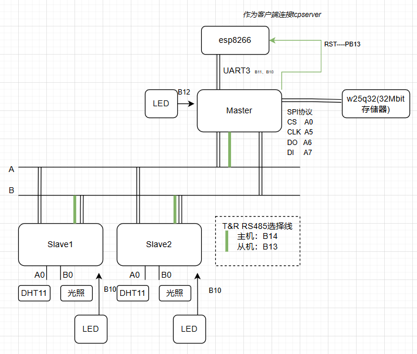
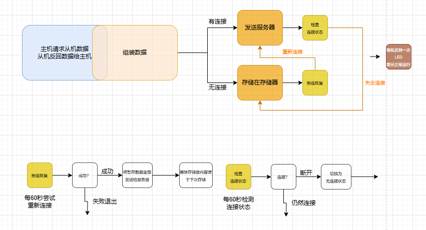

# RS485GrowingItem

## Brief introduction

基于stm32f103c8t6,使用三个stm32通过rs485协议进行主从机通信。发挥rs485可靠性强、通信距离长的特点，让从机在温室大棚的不同区域检测温湿度数据并告知主机，主机整理数据基于esp8266模块通过tcp在局域网下连接基于qt的服务端。qt服务端负责实时显示温湿度数据、存储数据到mysql数据库，向stm32发送控制指令等。

## Latest Connection

## 主机运行逻辑

## sensor used

1.温湿度：dth11

2.光照传感器

3.存储器：w25q32

4.rs485模块*3

## first_project

最开始的，较为简单,主机向从机请求数据，从机返回数据。

## second_staged_project

增加了基于qt的tcpserver显示和存储数据

## third_staged_project

1.增加断连tcpserver时，存储采集数据到外部存储器

重新连接后发送给tcpserver保存在数据库

2.主从机增加了频闪灯，表示设备正常运行

## four_staged_project

1.对esp8266增加rst控制线，解决正常连接然后断连，esp8266仍然处于透传模式，重连时无法重连的问题。

2.整理了代码解决了其他小问题

3.修复从机返回数据不稳定的问题

### Function unrealized

qt端对stm32的控制配置

