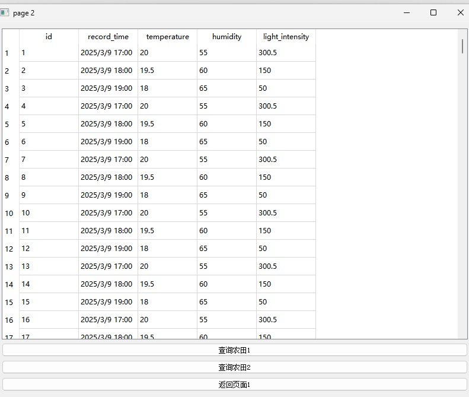

## 功能

主机发送从机，每隔一段时间询问从机温湿度及光照，从机应答。主机再发送数据到tcpserver

tcpserver保存数据到数据库。若没有连接到tcpserver，暂时保存在主机的外部存储器，连接后再发送给tcpserver。

主机从机都有一个频闪指示灯代表正常运行。

## Connection

## 

### 主机发送指令 ：

主机名：如1、2 一个字节

### 从机返回信息

【temp】【humi】【light】三个字节

## 逻辑过程

#### 主机逻辑

## TCPServer

## 实物连接

## 串口1数据说明

## 其他说明

从机1、2、3....的代码都是RS485_slave,将对应名字改成1、2、3......即可。最多255个，8个字节

