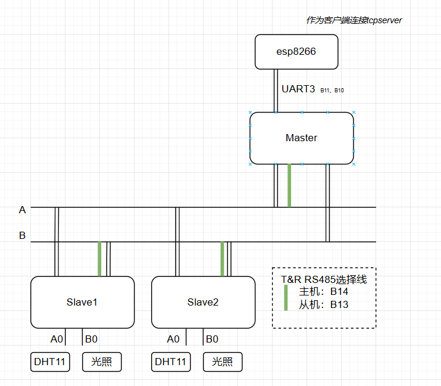
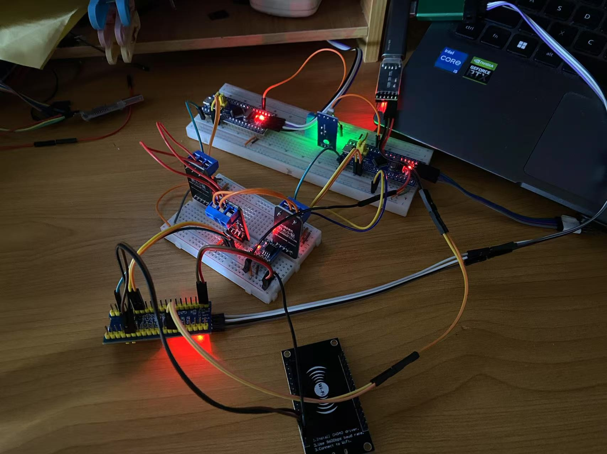

## 功能

主机发送从机，每隔一段时间询问从机温湿度及光照，从机应答

## Connection

## 指令格式

### 主机发送指令 ：

主机名：如1、2 一个字节

### 从机返回信息

【temp】【humi】【light】三个字节

## 逻辑过程

主机每隔5秒向从机们询问数据、主机将获得的数据整合在一起发送给tcpserver。

tcpserver实时显示数据，接收到的数据存在数据库中，可以查询历史数据。

## TCPServer

## 实物连接

## 其他说明

从机1、2、3....的代码都是RS485_slave,将对应名字改成1、2、3......即可。最多255个，8个字节

从机代码和firstproject的一样
