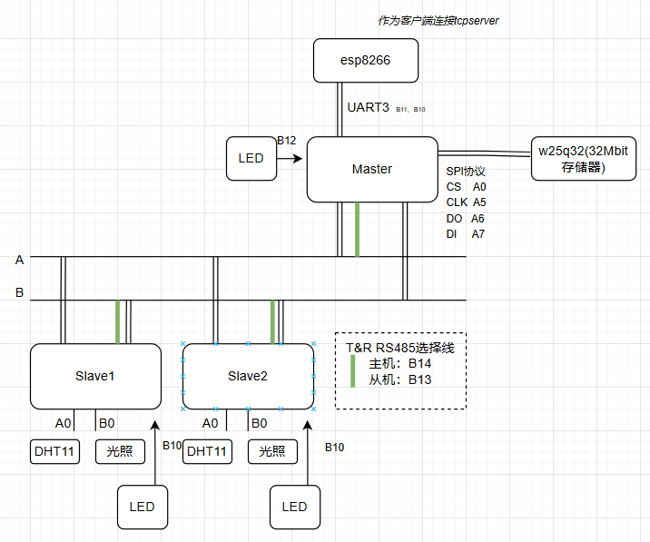
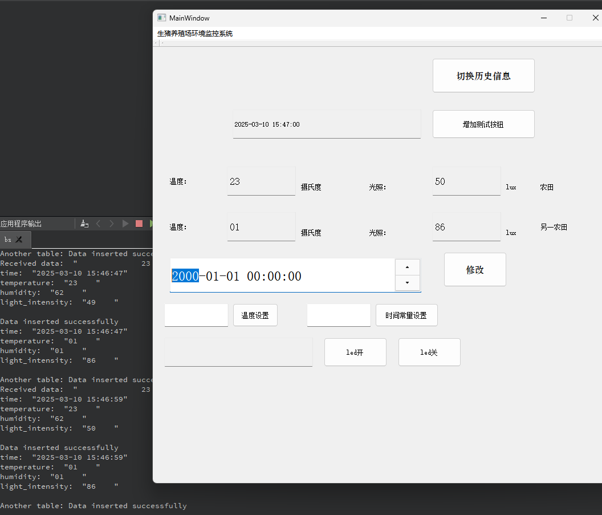
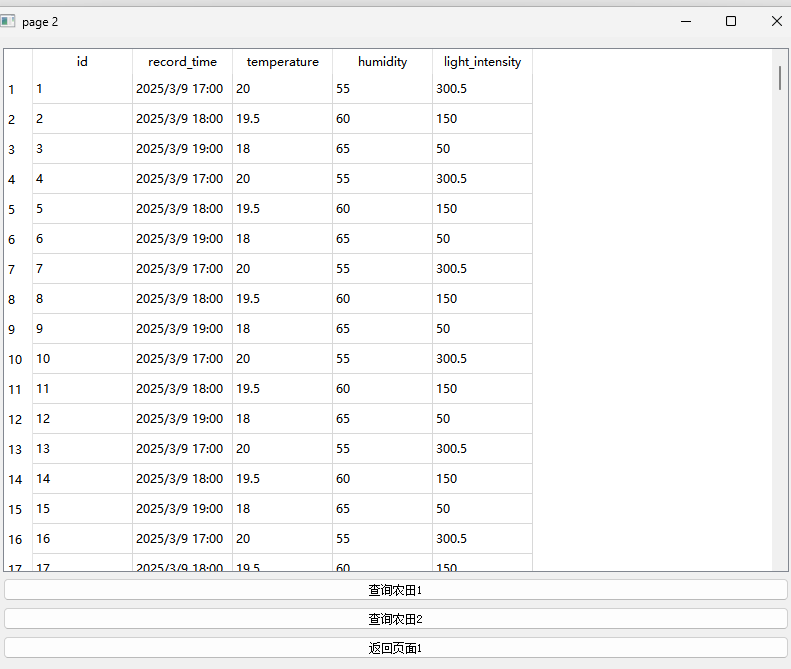
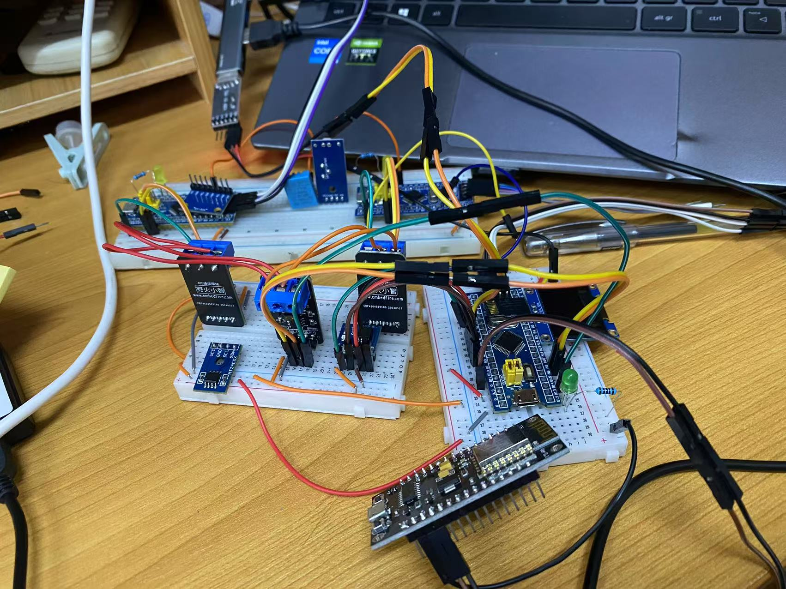

## 功能

主机发送从机，每隔一段时间询问从机温湿度及光照，从机应答。主机再发送数据到tcpserver

tcpserver保存数据到数据库。若没有连接到tcpserver，暂时保存在主机的外部存储器，连接后再发送给tcpserver。

主机从机都有一个频闪指示灯代表正常运行。

## Connection

## 

### 主机发送指令 ：

主机名：如1、2 一个字节

### 从机返回信息

【temp】【humi】【light】三个字节

### 主机发送给Server信息

#### 总共50字节

年 月 日 时 分 秒 温度1（6字节）湿度1（6字节）光照1（6字节）温度2（6字节）湿度2（6字节）光照2（6字节）

目前从机拓展不灵活

## 逻辑过程

主机每隔5秒向从机们询问数据、主机将获得的数据整合在一起发送给tcpserver。

tcpserver实时显示数据，接收到的数据存在数据库中，可以查询历史数据。

## TCPServer

## 实物连接

## 其他说明

从机1、2、3....的代码都是RS485_slave,将对应名字改成1、2、3......即可。最多255个，8个字节

